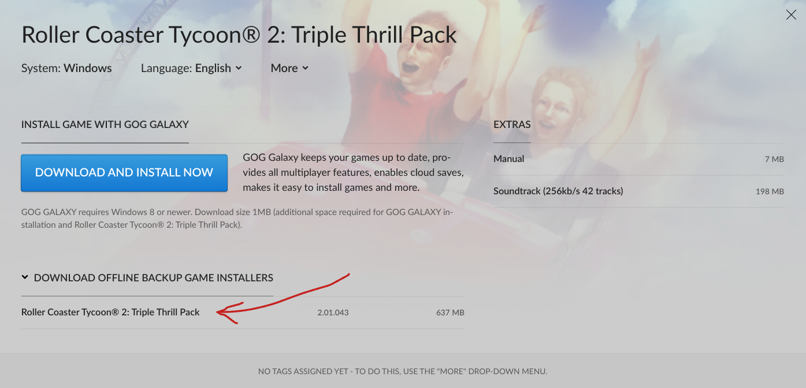

## Running Roller Coaster Tychoon 🎢 on Linux (chromebook) 💻

I hit some snags when following the [official documentation](https://openrct2.org/quickstart) for OpenRCT2.  
Instead of making use of their `PPA`, I went with the option to use the [flatpak](https://flatpak.org/) as stated in the [github readme](https://github.com/OpenRCT2/OpenRCT2) for the project.

### Setup flatpak
1. check if you have `flatpak` installed on your machine by running:
   ```bash
   flatpak --version
   ```
   if you see a flatpak version printed out in the terminal, skip the next step and go to step 3. 
1. If you dont have flatpak installed, get it by running: 
   ```bash
   apt install flatpak
   ```
1. Add the flathub repository to flatpak by running: 
   ```bash
   flatpak remote-add --if-not-exists flathub https://dl.flathub.org/repo/flathub.flatpakrepo
   ```
1. Get the [OpenRCT2 flatpak](https://flathub.org/apps/io.openrct2.OpenRCT2) by running: 
   ```bash
   flatpak install flathub io.openrct2.OpenRCT2
   ```
1. Install [innoextract](https://constexpr.org/innoextract/)
1. Purchase the original game of Roller Coaster Tycoon® 2: Triple Thrill Pack by heading over to [GOG](https://www.gog.com/en/game/rollercoaster_tycoon_2).
1. In the top menu bar on GOG, click the icon with your account name, then click "Games", then click on "Roller Coaster Tycoon® 2: Triple Thrill Pack
".
1. Download the offline backup game installer:

   The downloaded file should be named something like `setup_rollercoaster_tycoon_2_triple_thrill_pack_2.01.043_(17987).exe`.
1. Open a terminal and create a directory somewhere suitable on your machine, for example at
   ```bash
   mkdir ~/rct2
   ```
   change the working directory to the newly created directory
   ```bash
   cd ~/rct2
   ```
1. Copy over the offline backup game installer that you downloaded earlier to this directory.
1. Extract the game files by running `innoextract` on the file by running  
   ```bash
   innoextract `setup_rollercoaster_tycoon_2_triple_thrill_pack_2.01.043_(17987).exe`
   ```
   This should give you two new directories, `tmp` and `app`.


### Start the game
Start the game by opening a terminal and running: 
```bash
flatpak run io.openrct2.OpenRCT2
```
If it's the first time starting the game, a dialog will ask you to provide the path of the game files, which should be something like: 
```
/home/YOUR_USERNAME/documents/rct/app
```

### Configure
You can do some additional setup by editing the `config.ini` at this path
```bash
/home/YOUR_USERNAME/.var/app/io.openrct2.OpenRCT2/config/OpenRCT2/config.ini
```