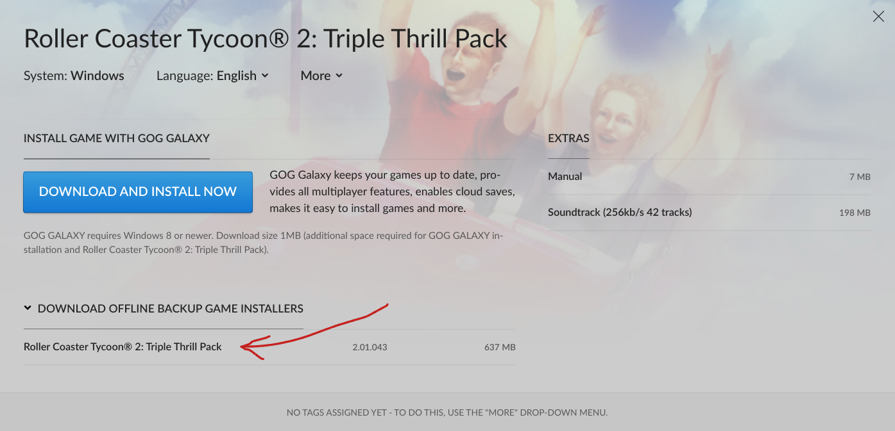
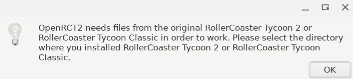
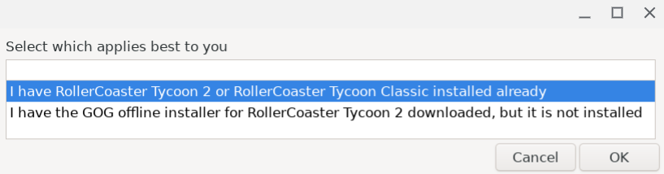
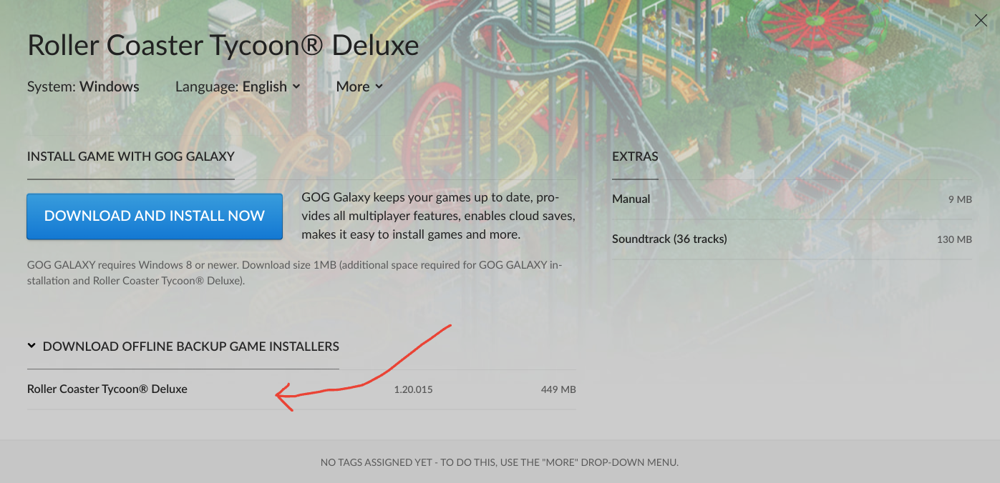
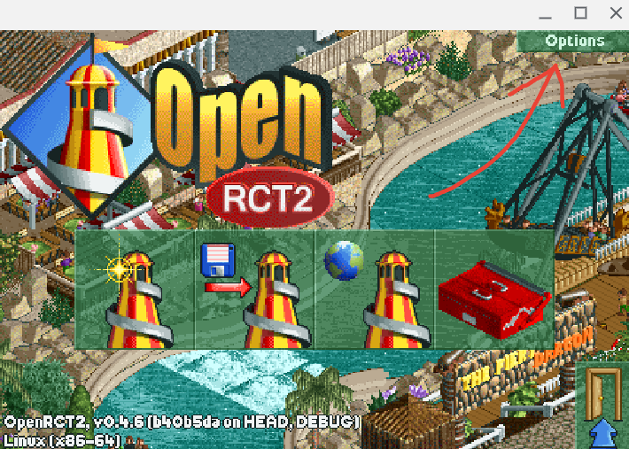
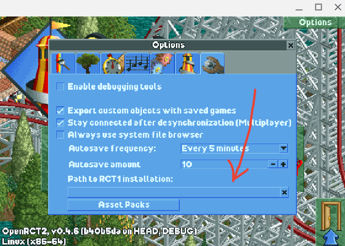

## Running Roller Coaster Tychoon 🎢 on Linux (chromebook) 💻

I hit some snags when following the [official documentation](https://openrct2.org/quickstart) for OpenRCT2.  
Instead of making use of their `PPA`, I went with the option to use the [flatpak](https://flatpak.org/) as stated in the [github readme](https://github.com/OpenRCT2/OpenRCT2) for the project.

### Setup Linux on your Chromebook
Before starting this guide, make sure you have Linux set up on your Chromebook. If you need help setting it up, have a look at this documentation [this documentation](https://support.google.com/chromebook/answer/9145439?hl=en).

### Setup flatpak
1. check if you have `flatpak` installed on your machine by running:
   ```bash
   flatpak --version
   ```
   if you see a flatpak version printed out in the terminal, skip the next step and go to step 3. 
1. If you dont have flatpak installed, get it by running: 
   ```bash
   apt install flatpak
   ```
1. Add the flathub repository to flatpak by running: 
   ```bash
   flatpak remote-add --if-not-exists flathub https://dl.flathub.org/repo/flathub.flatpakrepo
   ```
1. Get the [OpenRCT2 flatpak](https://flathub.org/apps/io.openrct2.OpenRCT2) by running: 
   ```bash
   flatpak install flathub io.openrct2.OpenRCT2
   ```

### Setup innoextract
Install [innoextract](https://constexpr.org/innoextract/).
```bash
apt-get install innoextract
```

### Get the original game files for Rct2
1. Purchase the original game of `Roller Coaster Tycoon® 2: Triple Thrill Pack` by heading over to [GOG](https://www.gog.com/en/game/rollercoaster_tycoon_2).
1. In the top menu bar on GOG, click the icon with your account name, then click "Games", then click on "Roller Coaster Tycoon® 2: Triple Thrill Pack".
1. Download the offline backup game installer:

   The downloaded file should be named something like `setup_rollercoaster_tycoon_2_triple_thrill_pack_2.01.043_(17987).exe`.
1. Open a terminal and create a directory somewhere suitable on your machine, for example at
   ```bash
   mkdir ~/rct2
   ```
   change the working directory to the newly created directory
   ```bash
   cd ~/rct2
   ```
1. Copy over the offline backup game installer that you downloaded earlier to this directory.
1. Extract the game files by running `innoextract` on the file by running  
   ```bash
   innoextract `setup_rollercoaster_tycoon_2_triple_thrill_pack_2.01.043_(17987).exe`
   ```
   This should give you two new directories, `tmp` and `app`.


### Start the game
Start the game by opening a terminal and running: 
```bash
flatpak run io.openrct2.OpenRCT2
```

#### Configuring the game path (only needed at first launch)
If it's the first time starting the game, a dialog will ask you to provide the path of the game files:  


select the option that you already have the game installed, then click OK  


navigate the file browser to the app folder path, which should be something like `/home/YOUR_USERNAME/documents/rct2/app`, then click OK  


### Get the original game files for Rct1 (optional)
This step is optional, but if you are like me and think that the original Rct1 game is the best game ever made, continue with the following steps:

1. Purchase the original game of `Roller Coaster Tycoon® Deluxe` by heading over to [GOG](https://www.gog.com/en/game/rollercoaster_tycoon_deluxe).
1. In the top menu bar on GOG, click the icon with your account name, then click "Games", then click on "Roller Coaster Tycoon® Deluxe".
1. Download the offline backup game installer:

   The downloaded file should be named something like `setup_rollercoaster_tycoon_2_triple_thrill_pack_2.01.043_(17987).exe`.
1. Open a terminal and create a directory somewhere suitable on your machine, for example at
   ```bash
   mkdir ~/rct1
   ```
   change the working directory to the newly created directory
   ```bash
   cd ~/rct1
   ```
1. Copy over the offline backup game installer that you downloaded earlier to this directory.
1. Extract the game files by running `innoextract` on the file by running  
   ```bash
   innoextract `'setup_rollercoaster_tycoon_deluxe_1.20.015_(17822) (1).exe'`
   ```
   This should give you two new directories, `tmp` and `app`.
1. Start the game [as described above](#Start-the-game)
1. Click `options` in the main menu  

1. Click the `Path to RCT1 installation` in the tab with a wrench icon  

1. Provide the path of the game files, which should be something like: 
```
/home/YOUR_USERNAME/documents/rct1/app
```
1. Close the game and open it again.

### Configure
You can do some additional setup by editing the `config.ini` at this path
```bash
/home/YOUR_USERNAME/.var/app/io.openrct2.OpenRCT2/config/OpenRCT2/config.ini
```

For example, I personally thought the game was too zoomed out.
Luckily, there is a value you can edit in the config file that adjusts the scaling factor of the window.
Open your favorite editor and edit the file like:
```bash
nano /home/YOUR_USERNAME/.var/app/io.openrct2.OpenRCT2/config/OpenRCT2/config.ini
```
And scroll down until you see a value named ```window_scale```. The default value for this is `1.000000`.
I thought a better value for this was `1.650000`, but that's just personal preference.  
Save the file.  
If you had the game running when changing this file, you need to first close the game and then start it again as described in [starting the game](#Start-the-game)

